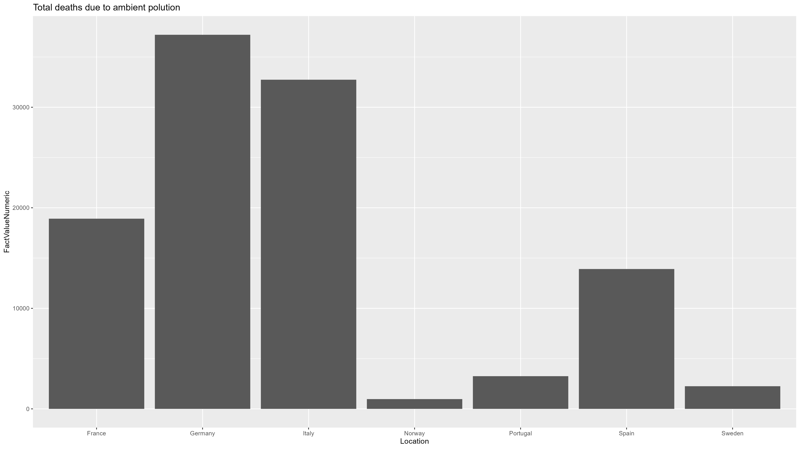

```{r setup, include=FALSE}
knitr::opts_chunk$set(echo = FALSE, warning = FALSE, message = FALSE)
```

## Introduction

This is a capstone project for the seminar "Data Mining in R" at the University of Lucerne, spring semester 2023. The capstone project should reflect both the ability to apply data mining techniques in practice and the originality and relevance of the application.

### Research Question

For the capstone project the students were free to choose a topic and the data they wanted to use. Id would be of advantage if part of the code or the results used in the capstone project could be implemented in a following paper or thesis the student might work on. In my case, I have no more papers due for my Master's degree and the only open paper is my Master Thesis, which I will be starting with next semester. For the moment I have still not decided what will be the research question I will want to answer with my thesis, but I know, that the research will be done in the field of political science and most probalby around the topics European Union and climate policy. 

I would also like to mention that this is the second time I have attended a seminar on R Studio. My goal for this seminar was simply to learn additional skills with R and to learn new ways to collect data from the web. I would describe my R Studio skills as quite basic. I have done a few plots here and there and one or two regression analyses for a paper. Other than that, I'd say I'm still at the beginning of my learning curve with this program and language. 
As a result of the above situation regarding my Master's thesis and the state of my studio skills, I wanted to focus on a fairly basic research question regarding climate change in Europe. 

Does climate change have a greater impact on southern European countries than on central and northern European countries?

### Ideas

First, I thought about using the "rest" package to scrape a news article website like zeit.de or elpais.es about climate change policies in the respective countries. Then I thought about doing a sentiment analysis with the information I got. But the more I thought about it, the less it seemed like a good idea, as we were going to do a Guardian API scrape and a sentiment analysis in the group project anyway. 

I thought about concentrating on the API as it seemed like a method I would be more likely to use in the future for my Master's thesis. I struggled to find a good API for environmental data. It was quite late in my project that I found the EEA API database. I haven't been able to try it out yet, but I think it could be useful in the future. 

## Difficulties with data scraping
### Worldbank Database

The World Bank has information on everything, including climate reports, environmental projects and more. 

I use the following code to try my first scrape on the Worldbank database. 

```{r First scrape, echo=TRUE, eval=FALSE, include=TRUE, results='hide'}
#I search the WORLDBANK API for Documents regarding the topic energy and that include the term "water" in the title

response <- httr::GET("https://search.worldbank.org/api/v2/wds?format=json&qterm=energy&display_title=water&fl=display_title")
content_WB <- content(response, as = "parsed")

#I know want to have the necessary information such as document ID, Title and the direct PDF link in a data frame
data_WB <- tibble(
  ID = map_chr(content_WB$documents, 1), 
  TITLE = map_chr(content_WB$documents, 4), 
  PDF = map_chr(content_WB$documents, 5) 
)
```

I get the following error message:

Error in `map_chr()`:
i In index: 11.
i With name: facets.
Caused by error:
! Result must be length 1, not 0.
Run `rlang::last_error()` to see where the error occurred

I then subtract the empty sublist so I get the data frame. From this I get the data frame with the necessary information.

```{r eval=FALSE, echo=TRUE, eval=FALSE, include=TRUE}
#I delete the sublist so I can create a data frame with the tibble function
content_WB <- content_WB$documents[-11]

# I create a data frame with ID, TITLE and PDF URL of the documents
data_WB <- tibble(
  ID = map_chr(content_WB, 1), 
  TITLE = map_chr(content_WB, 4), 
  PDF = map_chr(content_WB, 5) 
)
```

The data frame doesn't contain much information. Only ten reports and their PDF URLs are displayed.  

I am now trying to narrow down the World Bank database to results on water in Spain. The documentation on the API is needed for this. Again, I only get 7 results. 

I try to create a loop to download all the PDFs from the URLs and save them on my computer. 

```{r eval=FALSE, echo=TRUE, eval=FALSE, include=TRUE}
for (i in seq_along(data_spain$PDF)) {
  # Get the filename from the URL
  filename <- basename(data_spain$PDF[i])
  
  # Build the output path for the file
  output_path <- file.path(pdf_dir, filename)
  
  # Download the file from the URL and save it to the output path
  GET(data_spain$PDF[i], write_disk(output_path))
}
```

The data frame has several invalid or incomplete URLs. Accordingly, the loop does not work. 

In my opinion, the available data from the World Bank is rather uninteresting and I therefore decide to use a new API. 

### WHO Database

WHO also provides an API to access its database. WHO also provides an API to access its database. Although the WHO focuses on health and disease, important data on the impact of climate change can also be found. 

For example, it would be interesting to know how climate change is affecting people's health. So I scrape the data for "Deaths attributable to air pollution". Then I filter the data for the countries I'm interested in. 

The data still contains several variables that need to be filtered. But the data frame contains only IDs, without any further information about the numbers. So I try to scrape the filtered data directly. 

```{r eval=FALSE, echo=TRUE, eval=FALSE, include=TRUE}
#Try to use filter to receive filtered data for both sex
#Error message appears
response_filter <-  httr::GET(
  url = "https://ghoapi.azureedge.net/api/AIR_41$filter=Dim1%20eq%20%27BTSX%27",
  verbose())

#Try other method to use filter to receive filtered data for both sex
#This method is stated in the documentation from GHO API 
#Error message appears. Try to find a solution but couldn't
response_filter <-  httr::GET(
  url = "https://ghoapi.azureedge.net/api/WHOSIS_000001?$filter=Dim1 eq 'MLE'",
  verbose())

```

As stated in the code both ways don't work. I have not found a solution for an exact scraping, so I decide to continue with the data frames provided by WHO at https://platform.who.int/data/



As you can see from the graph. France, Italy and Germany are particularly affected by air pollution, while the other countries on the graph are less affected. This is probably due to the fact that there are more regions with a high concentration of industry. 


## Reorientation of the project

At that point, I spent a lot of time scraping for data. After the failed attempt to scrape the WHO data filtered by the documentation, I rethought the goal of this project. 

As can be seen above, I am now using this project to work on my scraping skills and to consolidate my R knowledge. So I thought I would use the first failed part as a kind of learning report and delve into the second part with an API that has good documentation or if possible even an R function. 

At the beginning I thought of the openweather API. However, since only single calls can be made with the free version and therefore historical data over a certain period of time cannot be retrieved, I decide to use an API that has nothing to do with my topic, but which I will have fun working with and is easier to use. 

This will be the spotifyr function.

### Spotfiyr


